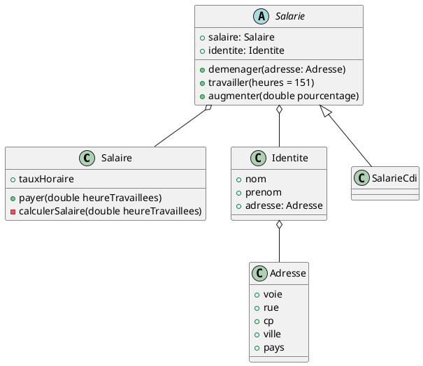

# TP 2 - Application de gestion du personnel

## Ce projet à pour but de réaliser les fonctionnalités et les tests pour une application de gestion de personnel

### Diagramme de classe

### Installation

1. Cloner le répo puis exécuter la commande (git clone url du répo)
2. Ouvrez le projet avec IntelliJ
3. Allez dans Pom.xml puis recharger le projet (Clic droit > Maven > Reload Project)
4. Allez dans le dossier test > java > m2i.valentin.tp2.classes puis choissiez le package que vous voulez tester.
5. Exécuter un test à l'aide de la petite icône à côté des classes ou des méthodes spécifiques.